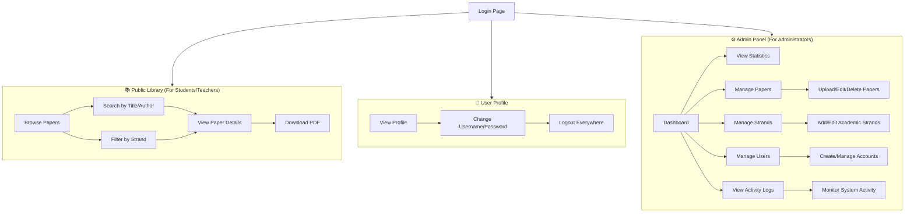
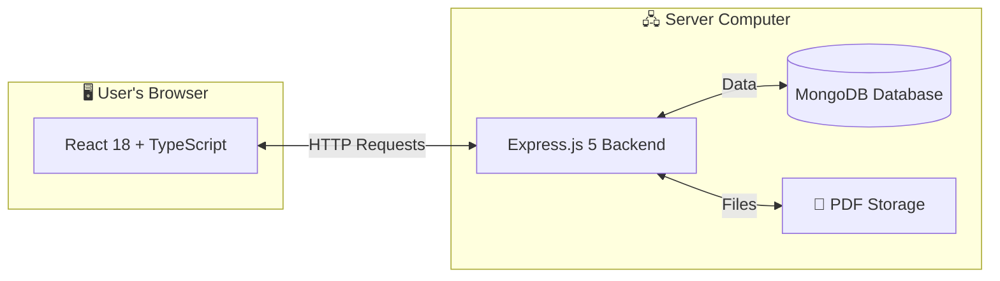
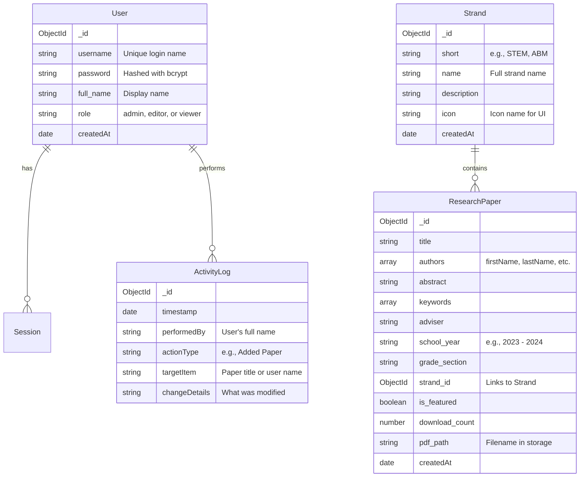

# CVNHS Electronic Research Library - Comprehensive Documentation

> **A digital archive system for Catubig Valley National High School's student research papers**

---

## 📋 Executive Summary

The **CVNHS Electronic Research Library** is a web-based application designed to digitize, organize, and share student research papers from Catubig Valley National High School. It serves as a centralized repository where students, teachers, and administrators can browse, search, and access academic research organized by academic strands.

### Who Is This For?

| Role | What They Can Do |
|------|------------------|
| **Students/Viewers** | Browse and download research papers for reference and inspiration |
| **Editors** | Access papers plus edit their own profile and some content |
| **Teachers** | Access student work, track submissions, and guide research |
| **Administrators** | Full system access: manage users, strands, papers, view activity logs, and analytics |

---

## 🎯 What Does This System Do?



### Core Features

#### 1. 📖 Research Paper Management
- **Upload** research papers as PDF files (max 50MB)
- **Organize** papers by academic strand (STEM, ABM, HUMSS, etc.)
- **Track** download counts and statistics
- **Feature** outstanding papers on the homepage

#### 2. 🏷️ Strand Organization
- Create and manage academic strands/tracks
- Each strand has a short code, full name, description, and icon
- Papers are categorized under their respective strands

#### 3. 👥 User Management
- **Admins**: Full access to all features including activity logs
- **Editors**: Can manage content with limited administrative access
- **Viewers**: Can browse and download papers only
- Session-based login with automatic session expiry (15 minutes)

#### 4. 📊 Analytics Dashboard
- Total papers in the library
- Download statistics by strand
- School year distribution charts
- Recent uploads tracking
- Registered users count

#### 5. 📜 Activity Logging
- Tracks all system actions (logins, uploads, edits, deletions)
- Displays who performed each action
- Records timestamps and change details
- Auto-deletes logs older than 1 year

#### 6. 👤 Profile Settings
- Users can update their own username and password
- Requires current password for security verification
- "Logout Everywhere" feature to terminate all active sessions

---

## 🏗️ Technical Architecture

### System Overview



### Technology Stack

| Layer | Technology | Purpose |
|-------|------------|---------|
| **Frontend** | React 18 + TypeScript | User interface |
| **Build Tool** | Vite 5 | Fast development & production builds |
| **Styling** | Tailwind CSS + shadcn/ui | Modern, responsive design |
| **Animations** | Framer Motion | Smooth UI transitions |
| **State** | Zustand | Application state management |
| **Data Fetching** | TanStack Query | Server state & caching |
| **Backend** | Express.js 5 (Node.js) | API server |
| **Database** | MongoDB + Mongoose 9 | Data storage |
| **Authentication** | express-session + bcrypt | Secure login |
| **File Upload** | Multer 2 | PDF document handling |
| **File Storage** | Local filesystem (APPDATA) | PDF documents |

---

## 📁 Project Structure

```
cvnhs_electronic_research_library/
├── 📁 backend/                  # Server-side code
│   ├── models/                  # Database schemas
│   │   ├── User.js              # User accounts (admin/editor/viewer)
│   │   ├── Strand.js            # Academic strands
│   │   ├── ResearchPaper.js     # Research papers
│   │   └── ActivityLog.js       # System activity logs
│   ├── server.js                # Main API server (1100+ lines)
│   ├── .env                     # Configuration secrets
│   └── package.json             # Dependencies
│
├── 📁 frontend/                 # Client-side code
│   ├── src/
│   │   ├── pages/               # Page components
│   │   │   ├── Index.tsx        # Home page
│   │   │   ├── AllPapersPage.tsx
│   │   │   ├── PaperDetailPage.tsx
│   │   │   ├── StrandsPage.tsx
│   │   │   ├── AboutPage.tsx
│   │   │   ├── ProfileSettingsPage.tsx  # Account settings
│   │   │   ├── NotFound.tsx
│   │   │   └── admin/           # Admin panel pages
│   │   │       ├── AdminLoginPage.tsx
│   │   │       ├── AdminDashboardPage.tsx
│   │   │       ├── AdminPapersPage.tsx
│   │   │       ├── AdminStrandsPage.tsx
│   │   │       ├── AdminUsersPage.tsx
│   │   │       └── AdminActivityLogsPage.tsx
│   │   ├── components/          # Reusable UI components
│   │   │   ├── ui/              # 49 shadcn components
│   │   │   ├── home/            # Homepage sections (Hero, Featured, Strands)
│   │   │   ├── admin/           # Admin UI elements
│   │   │   ├── auth/            # Login animations & protected routes
│   │   │   ├── layout/          # Header, Footer, etc.
│   │   │   └── papers/          # Paper display components
│   │   ├── store/               # State management
│   │   │   ├── adminStore.ts    # Auth & admin state
│   │   │   └── useStore.ts      # General app state
│   │   └── types/               # TypeScript definitions
│   │       ├── paper.ts         # Research paper types
│   │       ├── strand.ts        # Strand types
│   │       └── dashboard.ts     # Dashboard stat types
│   └── package.json
│
├── DOCUMENTATION.md             # This file
├── README.md                    # Quick start guide
└── DEPLOYMENT_GUIDE.md          # Production deployment steps
```

---

## 💾 Database Structure

### Collections (Tables)



---

## 🔌 API Reference

### Authentication Endpoints

| Method | Endpoint | Description | Auth Required |
|--------|----------|-------------|---------------|
| `POST` | `/api/auth/login` | Login with username/password | No |
| `POST` | `/api/auth/logout` | End session | Yes |
| `GET` | `/api/auth/me` | Get current user info | Yes |

### User Management

| Method | Endpoint | Description |
|--------|----------|-------------|
| `GET` | `/api/users` | List all users |
| `POST` | `/api/users` | Create new user |
| `PUT` | `/api/users/:id` | Update user (self or admin) |
| `DELETE` | `/api/users/:id` | Delete user |
| `GET` | `/api/users/sessions` | Get users with active sessions |
| `DELETE` | `/api/users/:id/sessions` | Kick user (terminate all sessions) |

### Research Papers

| Method | Endpoint | Description |
|--------|----------|-------------|
| `GET` | `/api/papers` | List all papers |
| `GET` | `/api/papers/:id` | Get single paper details |
| `POST` | `/api/papers` | Upload new paper (with PDF) |
| `PUT` | `/api/papers/:id` | Update paper (optional new PDF) |
| `DELETE` | `/api/papers/:id` | Delete paper and file |
| `GET` | `/api/papers/view/:id` | Stream PDF in browser |
| `GET` | `/api/papers/download/:id` | Download PDF (increments counter) |

### Strands

| Method | Endpoint | Description |
|--------|----------|-------------|
| `GET` | `/api/strands` | List all strands with paper counts |
| `POST` | `/api/strands` | Create new strand |
| `PUT` | `/api/strands/:id` | Update strand |
| `DELETE` | `/api/strands/:id` | Delete strand |

### Activity Logs

| Method | Endpoint | Description |
|--------|----------|-------------|
| `GET` | `/api/activity-logs` | Get activity logs (Admin only, last 100) |
| `DELETE` | `/api/activity-logs` | Clear all activity logs (Admin only) |

### Statistics

| Method | Endpoint | Description |
|--------|----------|-------------|
| `GET` | `/api/stats` | Public stats (papers, downloads, strands) |
| `GET` | `/api/dashboard/stats` | Detailed admin statistics |

---

## 🖥️ User Interface Pages

### Public Pages (Require Login)

| Page | URL | Purpose |
|------|-----|---------|
| **Home** | `/home` | Hero section, featured papers, strand showcase |
| **All Papers** | `/papers` | Browse and search all papers |
| **Paper Details** | `/papers/:id` | View paper info and download PDF |
| **Strands** | `/strands` | Browse papers by academic strand |
| **About** | `/about` | Information about the library |
| **Profile** | `/profile` | Account settings (username, password) |

### Admin Pages (Require Admin Role)

| Page | URL | Purpose |
|------|-----|---------|
| **Login** | `/` or `/admin/login` | Authentication with animated UI |
| **Dashboard** | `/admin` | Statistics, charts, and recent activity |
| **Papers** | `/admin/papers` | Manage research papers (CRUD) |
| **Strands** | `/admin/strands` | Manage academic strands |
| **Users** | `/admin/users` | Manage user accounts & sessions |
| **Activity Logs** | `/admin/activity-logs` | View system activity history |

---

## 🔐 Security Features

1. **Password Hashing**: All passwords are hashed using bcrypt (10 salt rounds)
2. **Session Management**: 
   - Sessions stored in MongoDB
   - 15-minute expiry with rolling refresh
   - HTTP-only cookies
3. **Route Protection**: All sensitive routes require authentication
4. **Role-Based Access**: 
   - Activity logs are admin-only
   - Viewers cannot edit their own name
   - Editors have intermediate permissions
5. **Input Validation**: File type checking (PDF only), size limits (50MB)
6. **Self-Protection**: Users cannot delete their own accounts
7. **Logout Everywhere**: Users can terminate all their active sessions

---

## 🚀 Quick Start Guide

### For Development

```bash
# 1. Start MongoDB (must be running)

# 2. Backend Setup
cd backend
npm install
npm run dev   # Uses nodemon for auto-reload

# 3. Frontend Setup (new terminal)
cd frontend
npm install
npm run dev
```

### Default Admin Account

| Field | Value |
|-------|-------|
| Username | `admin` |
| Password | `admin` |

> ⚠️ **Important**: Change the default password immediately after first login!

---

## 📦 Where Are Files Stored?

| Type | Location |
|------|----------|
| **PDF Files** | `%APPDATA%/cvnhs_electronic_research_library/cvnhs_research_papers/` |
| **Database** | MongoDB (local or configured URI) |
| **Sessions** | MongoDB `sessions` collection |

---

## 🎨 UI Components Library

The frontend uses **shadcn/ui**, providing 49+ pre-built components:

- Buttons, Inputs, Forms
- Modals (Dialogs)
- Tables with sorting
- Charts (via Recharts)
- Toasts/Sonner for notifications
- Command palette
- Dropdowns, Popovers, Tooltips
- And many more...

### Special UI Features

- **Animated Login**: Background particles, floating inputs, success confetti
- **Dark Mode**: Defaults to dark theme, toggle available
- **Framer Motion**: Smooth page transitions and micro-animations
- **Responsive Grid**: Adapts from mobile to desktop

---

## 📱 Responsive Design

The application is fully responsive:

| Device | Support |
|--------|---------|
| Desktop | ✅ Full layout with sidebar |
| Tablet | ✅ Adapted grid, collapsible sidebar |
| Mobile | ✅ Compact navigation, stacked layouts |

---

## 🔧 Configuration

### Environment Variables (`.env`)

```env
# MongoDB connection string
MONGO_URI=mongodb://localhost:27017/cvnhs_research_library

# Server port
PORT=5000

# Session encryption key (keep secret!)
SESSION_SECRET=your_secret_key_here
```

---

## 📊 Feature Summary

| Feature | Status |
|---------|--------|
| User Authentication | ✅ Session-based with auto-expiry |
| Role-Based Access | ✅ Admin/Editor/Viewer |
| Paper CRUD Operations | ✅ Full support with PDF |
| PDF Upload/Download | ✅ Streaming & download tracking |
| Search Functionality | ✅ By title, author, keyword |
| Download Tracking | ✅ Automatic counting |
| Strand Management | ✅ Full CRUD with icons |
| Admin Dashboard | ✅ Charts & statistics |
| Session Management | ✅ View active users, kick feature |
| Activity Logging | ✅ Full audit trail |
| Profile Settings | ✅ Self-service account updates |
| Logout Everywhere | ✅ Terminate all sessions |
| Dark Mode | ✅ Enabled by default |
| Responsive Design | ✅ Mobile-friendly |

---

## 📞 Support Information

This system was developed for **Catubig Valley National High School** as an electronic research archive. For technical support or feature requests, please contact the school's IT department.

---

*Documentation updated on January 2026*
